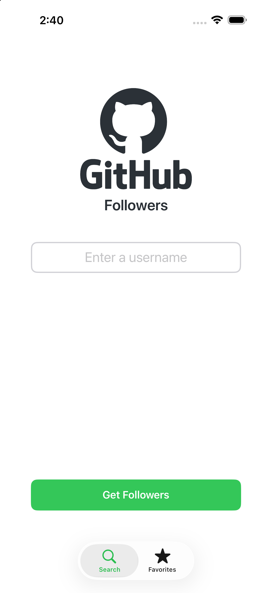
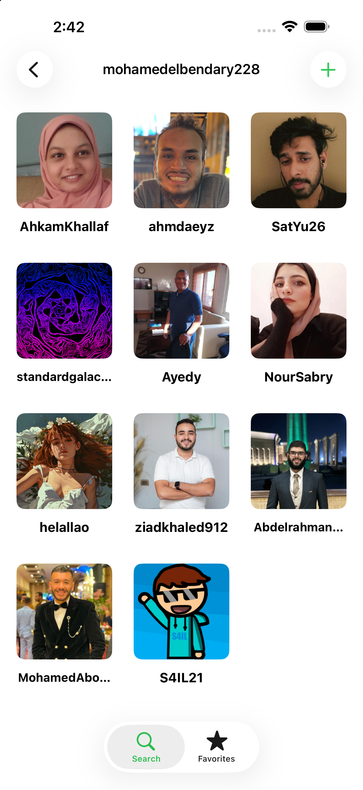
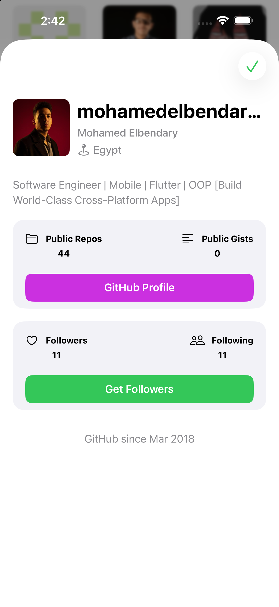
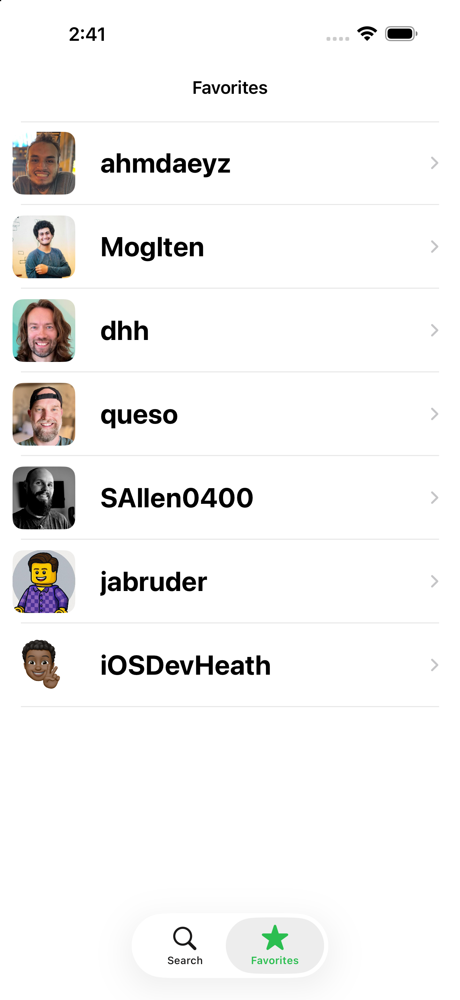
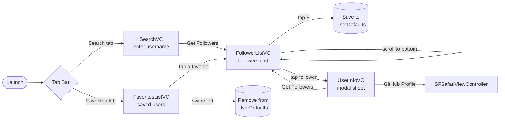
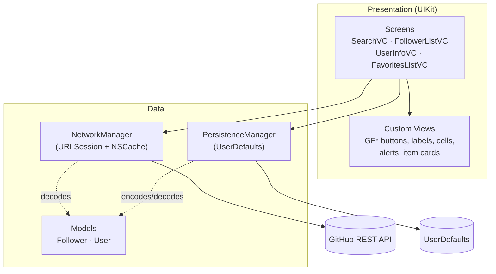

<div align="center">


# GH Followers

**Explore the followers of any GitHub user, dig into their profiles, and keep your favorites one tap away.**

A 100% programmatic UIKit app powered by the public [GitHub REST API](https://docs.github.com/en/rest/users).

<br />


[Features](#-features) ·
[Screenshots](#-screenshots) ·
[Getting Started](#-getting-started) ·
[Architecture](#-architecture) ·
[Project Structure](#-project-structure) ·
[Documentation](#-documentation)

</div>

---

## 📱 Screenshots

<table align="center">
  <tr>
    <th align="center">Search</th>
    <th align="center">Followers</th>
    <th align="center">User Details</th>
    <th align="center">Favorites</th>
  </tr>
  <tr>
    <td align="center"></td>
    <td align="center"></td>
    <td align="center"></td>
    <td align="center"></td>
  </tr>
  <tr>
    <td align="center"><sub>Type any GitHub username<br/>and tap <b>Get Followers</b></sub></td>
    <td align="center"><sub>Paginated 3-column grid<br/>with live filtering</sub></td>
    <td align="center"><sub>Profile, stats, and<br/>quick actions</sub></td>
    <td align="center"><sub>Saved users,<br/>swipe left to remove</sub></td>
  </tr>
</table>

---

## ✨ Features

| | Feature | What it does |
|:-:|---|---|
| 🔎 | **Search any user** | Enter a GitHub username to load everyone who follows them. |
| 🧱 | **Followers grid** | A 3-column grid of avatars and usernames, built with `UICollectionViewDiffableDataSource` for animated updates. |
| ♾️ | **Infinite scrolling** | Followers load in pages of 50. The next page is fetched when you scroll past the bottom of the grid. |
| ⚡ | **Live filtering** | The search bar filters the loaded followers by username as you type (case-insensitive). |
| 👤 | **User details sheet** | Tap a follower to see their avatar, username, name, location, bio, public repos, public gists, follower and following counts, and the month and year they joined GitHub. |
| 🌐 | **GitHub profile in-app** | **GitHub Profile** opens the user's page in an in-app Safari view (`SFSafariViewController`). |
| 🔁 | **Follower hopping** | **Get Followers** on a details sheet replaces the grid with *that* user's followers, so you can browse the network user by user. |
| ⭐ | **Favorites** | Tap **+** on a followers screen to save that user. Favorites are kept on the device across launches. |
| 👈 | **Swipe to delete** | Swipe left on a favorite to remove it. Tap a favorite to open their followers. |
| 🖼️ | **Image caching** | Avatars are cached in memory (`NSCache`), so scrolling back doesn't download them again. |
| 🎨 | **Polished states** | Custom alerts, a loading overlay, and themed empty-state screens for every edge case. |
| 🌗 | **Dark Mode** | Semantic system colors plus light and dark asset variants. |

---

## 🎨 Theme & Design Language

The UI follows a small, consistent design system built from reusable `GF*` components (see [UI Components](docs/UI_COMPONENTS.md)).

| Role | Color | Used for |
|---|---|---|
| **Primary / Accent** |  | "Get Followers" buttons, tab bar and navigation bar tint, "+" and "Done" buttons |
| **Secondary action** |  | "GitHub Profile" button |
| **Alert action** |  | Custom alert dismiss button |
| **Brand** |  | GitHub logo, app icon |
| **Surfaces** | `systemBackground` / `secondarySystemBackground` | Screens / info cards (18 pt corner radius) |
| **Text** | `label` / `secondaryLabel` | Titles / body, names, and bios |

- **Shape:** 10 pt corner radius on buttons, text fields, and avatars, 16 pt on alerts, and 18 pt on info cards.
- **Typography:** San Francisco system fonts. Bold for titles, medium for secondary titles, and Dynamic Type `body` / `headline` / `title2` for body text, buttons, and inputs.
- **Iconography:** SF Symbols (`magnifyingglass`, `star.fill`, `folder`, `text.alignleft`, `heart`, `person.2`, `mappin.and.ellipse`).

---

## 🚀 Getting Started

### Requirements

| Tool | Version |
|---|---|
| macOS | A version that runs Xcode 26.6+ |
| Xcode | **26.6 or later** (the project uses Xcode's synchronized folders and default-actor-isolation build settings) |
| iOS deployment target | **26.5** |
| Devices | iPhone & iPad (portrait) |

No CocoaPods, Carthage, or Swift Package dependencies. No API key is required.

### Installation

```bash
git clone https://github.com/mohamedelbendary228/GitHub-Followers.git
cd GitHub-Followers
open GHFollowers.xcodeproj
```

1. Select the **GHFollowers** scheme and an iOS 26.5+ simulator.
2. To run on a physical device, choose your own team under **Signing & Capabilities**. You may also need to change the bundle identifier (`com.mab.GHFollowers`).
3. Press **⌘R** to build and run.

### Try it

1. On the **Search** tab, type a username such as `mohamedelbendary228`, `dhh`, or `twostraws`, then tap **Get Followers** or press **Go** on the keyboard.
2. Scroll to load more, or use the search bar to filter by username.
3. Tap a follower to open their details sheet, then try **GitHub Profile** or **Get Followers**.
4. Tap **+** in the navigation bar to favorite the user whose followers you're viewing.
5. Open the **Favorites** tab, tap a user to see their followers, or swipe left to remove them.

---

## 🧭 User Flow



---

## 🏛 Architecture

GH Followers uses **MVC** with a few supporting patterns that keep the view controllers small:

- **Singleton network layer.** `NetworkManager.shared` wraps `URLSession`, decodes JSON with `Codable`, and owns the avatar image cache.
- **Stateless persistence.** `PersistenceManager` (a case-less `enum` with static methods) reads and writes favorites as JSON in `UserDefaults`.
- **Typed errors.** Requests return `Result<T, GFError>`. `GFError` is a `String`-backed enum whose raw values are the messages shown to the user.
- **Composition with child view controllers.** The details sheet is built from `GFUserInfoHeaderVC`, `GFRepoItemVC`, and `GFFollowerItemVC`, embedded as child view controllers.
- **Template method.** `GFItemInfoVC` defines the card layout. Subclasses fill in the content and override `actionButtonTapped()`.
- **Delegation.** Button taps travel from the info cards to `UserInfoVC`, then to `FollowerListVC`, using `weak` protocol references so there are no retain cycles.
- **Reusable base class.** `GFDataLoadingVC` adds the loading overlay and empty-state helpers to any screen that inherits from it.



➡️ For more detail, read [docs/ARCHITECTURE.md](docs/ARCHITECTURE.md).

---

## 🗂 Project Structure

```text
GitHub-Followers/
├── GHFollowers.xcodeproj
└── GHFollowers/
    ├── Screens/                    # One view controller per screen
    │   ├── SearchVC.swift          #   Username entry (Search tab root)
    │   ├── FollowerListVC.swift    #   Followers grid, pagination, filtering, add-to-favorites
    │   ├── UserInfoVC.swift        #   Modal profile sheet composed of child VCs
    │   └── FavoritesListVC.swift   #   Saved users (Favorites tab root)
    │
    ├── Custom Views/               # Reusable UI kit (GF = GitHub Followers)
    │   ├── Buttons/                #   GFButton
    │   ├── Cells/                  #   FollowerCell (grid), FavoriteCell (list)
    │   ├── ImageViews/             #   GFAvatarImageView (async + cached avatar)
    │   ├── Labels/                 #   GFTitleLabel, GFSecondaryTitleLabel, GFBodyLabel
    │   ├── TextFields/             #   GFTextField
    │   ├── TabBarControllers/      #   GFTabBarController (Search + Favorites)
    │   ├── ViewControllers/        #   GFAlertVC, GFDataLoadingVC, GFUserInfoHeaderVC
    │   │   └── ItemInfoVCs/        #   GFItemInfoVC (base), GFRepoItemVC, GFFollowerItemVC
    │   └── Views/                  #   GFAlertContainerView, GFEmptyStateView, GFItemInfoView
    │
    ├── Managers/
    │   ├── NetworkManager.swift    # GitHub API calls + avatar image cache
    │   └── PersistenceManager.swift# Favorites stored in UserDefaults
    │
    ├── Model/
    │   ├── Follower.swift          # login, avatarUrl
    │   └── User.swift              # full profile returned by /users/{username}
    │
    ├── Extensions/                 # UIViewController, UIView, UITableView, String, Date helpers
    ├── Utilities/
    │   ├── Constants.swift         # SFSymbols, Images, DeviceTypes
    │   ├── GFError.swift           # User-facing error messages
    │   └── UIHelper.swift          # 3-column flow layout factory
    │
    ├── Support/                    # AppDelegate, SceneDelegate, Assets, LaunchScreen
    ├── Screenshots/                # README images
    └── Info.plist
```

---

## 🌐 GitHub API Usage

| Purpose | Endpoint | Notes |
|---|---|---|
| Followers list | `GET https://api.github.com/users/{username}/followers?per_page=50&page={n}` | Decoded into `[Follower]` |
| User profile | `GET https://api.github.com/users/{username}` | Decoded into `User` |
| Avatars | `avatar_url` from the responses above | Cached in `NSCache` |

Requests are **unauthenticated**, so GitHub limits them to **60 requests per hour per IP address**. If you hit the limit, the app shows *"Invalid response from the server"*. See [docs/DATA_LAYER.md](docs/DATA_LAYER.md) for the full request pipeline, error mapping, and persistence format.

---

## 📚 Documentation

| Document | Contents |
|---|---|
| [Architecture](docs/ARCHITECTURE.md) | App launch, navigation, each screen's responsibilities, design patterns, how screens communicate, threading, and state management |
| [Data Layer](docs/DATA_LAYER.md) | Models, `NetworkManager`, pagination, image caching, `PersistenceManager`, and the `GFError` reference |
| [UI Components](docs/UI_COMPONENTS.md) | The `GF*` UI kit: purpose, configuration, and usage of each reusable view |
| [Contributing](docs/CONTRIBUTING.md) | Code conventions, how to add a screen or component, and known limitations and roadmap |

---

## 🛠 Tech Stack

- **Language:** Swift (Swift 5 language mode, `MainActor` default actor isolation, approachable concurrency)
- **UI:** UIKit, built entirely in code with Auto Layout (no storyboards apart from the launch screen)
- **Lists:** `UICollectionView` + `UICollectionViewDiffableDataSource`, and `UITableView`
- **Networking:** `URLSession` + `JSONDecoder` (`convertFromSnakeCase`)
- **Persistence:** `UserDefaults` + `JSONEncoder` / `JSONDecoder`
- **Web:** `SafariServices` (`SFSafariViewController`)
- **Caching:** `NSCache<NSString, UIImage>`

---

## 🗺 Roadmap Ideas

- [ ] Move networking to `async/await`
- [ ] Add a unit-test target for `NetworkManager`, `PersistenceManager`, and the date helpers
- [ ] Support an optional GitHub personal access token for higher rate limits
- [ ] Show a dedicated message when GitHub returns 403 or 404
- [ ] Fully reset pagination and search state when you switch users from the details sheet

The full list, with reasons, is in [docs/CONTRIBUTING.md](docs/CONTRIBUTING.md#known-limitations).

---

<div align="center">

### 👨‍💻 Author

**Mohamed Elbendary** · [@mohamedelbendary228](https://github.com/mohamedelbendary228)

If you find this project useful, consider giving it a ⭐

</div>
