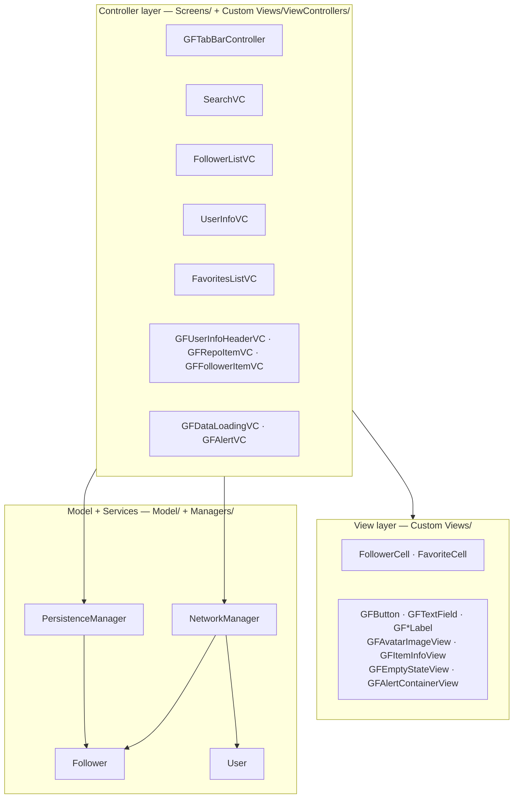
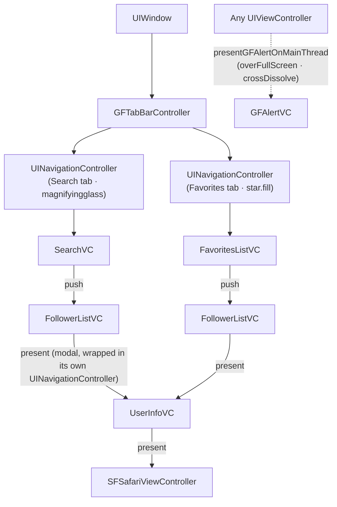
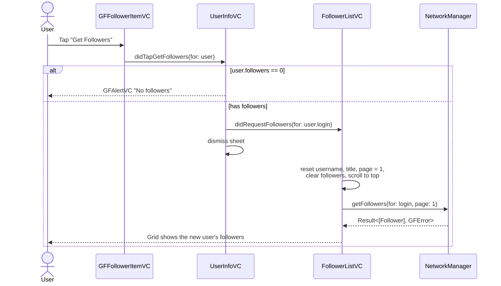
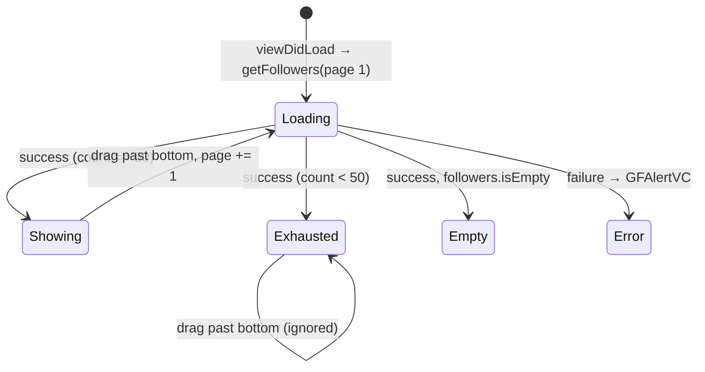

# Architecture

> [← Back to README](../README.md) · [Data Layer](DATA_LAYER.md) · [UI Components](UI_COMPONENTS.md) · [Contributing](CONTRIBUTING.md)

This document explains how GH Followers is put together: how the app launches, how screens are arranged and talk to each other, which design patterns are used and why, and how threading and state are handled.

---

## Contents

1. [Design goals](#design-goals)
2. [High-level overview](#high-level-overview)
3. [App launch](#app-launch)
4. [Navigation hierarchy](#navigation-hierarchy)
5. [Screens](#screens)
6. [Design patterns](#design-patterns)
7. [Communication between screens](#communication-between-screens)
8. [Concurrency and threading](#concurrency-and-threading)
9. [State management in `FollowerListVC`](#state-management-in-followerlistvc)
10. [Layout strategy](#layout-strategy)

---

## Design goals

| Goal | How it shows up in the code |
|---|---|
| **No third-party dependencies** | Only Foundation, UIKit, and SafariServices are used. |
| **Programmatic UI** | Every screen and view is built in code with Auto Layout. The only storyboard is the launch screen. |
| **Reusable building blocks** | All custom UI lives in `Custom Views/` behind a `GF` prefix and is configured in one place. |
| **Thin view controllers** | Networking, persistence, layout math, and alert presentation are moved out into managers, helpers, and extensions. |
| **User-friendly failure handling** | Every error becomes a readable message in a branded alert (`GFAlertVC`). |

---

## High-level overview

The app uses **MVC**. Views are dumb, reusable `GF*` components, models are plain `Codable` structs, and view controllers coordinate between them and two managers.



---

## App launch

1. `AppDelegate` is the standard `@main` entry point. It only hands off to the scene configuration.
2. `Info.plist` declares a single-window scene (`UIApplicationSupportsMultipleScenes = false`) and points to `SceneDelegate`.
3. `SceneDelegate.scene(_:willConnectTo:options:)`:
   - creates the `UIWindow` in code,
   - sets `GFTabBarController` as the `rootViewController`,
   - applies the global navigation-bar tint (`UINavigationBar.appearance().tintColor = .systemGreen`).
4. `GFTabBarController.viewDidLoad()` sets the tab-bar tint to `.systemGreen` and creates two navigation stacks: **Search** and **Favorites**.

There is no storyboard-based main interface. The launch screen (`Support/Base.lproj/LaunchScreen.storyboard`) is the only Interface Builder file.

---

## Navigation hierarchy



Some details:

- `SearchVC` hides the navigation bar in `viewWillAppear`. `FollowerListVC` shows it again.
- `UserInfoVC` is wrapped in its own `UINavigationController` so it can show a **Done** bar button. It is presented as a standard sheet.
- `GFAlertVC` is presented `.overFullScreen` with a `.crossDissolve` transition, so the dimmed screen underneath stays visible.

---

## Screens

### `SearchVC` (root of the Search tab)

| Responsibility | Implementation |
|---|---|
| Show the GitHub logo, username field, and CTA | `UIImageView` (`Images.ghLogo`), `GFTextField`, `GFButton(.systemGreen, "Get Followers")` |
| Validate input | `isUsernameEntered` computed property. An empty username shows an *"Empty username"* alert. |
| Navigate | Pushes `FollowerListVC(username:)` |
| Keyboard UX | Tap anywhere to dismiss (`UITapGestureRecognizer` → `endEditing`). **Go** on the keyboard triggers the same action (`UITextFieldDelegate.textFieldShouldReturn`). |
| Reset | Clears the text field in `viewWillAppear` |
| Small-screen tweaks | Uses a smaller top margin for the logo on iPhone SE / iPhone 8 Display Zoom (`DeviceTypes`) |

### `FollowerListVC` (subclass of `GFDataLoadingVC`)

The most complex screen in the app.

| Responsibility | Implementation |
|---|---|
| Show followers in a grid | `UICollectionView` + `UIHelper.createThreeColumnFlowLayout(in:)` + `FollowerCell` |
| Animated updates | `UICollectionViewDiffableDataSource<Section, Follower>`. `Follower` is `Hashable`, so diffs are computed automatically. |
| Load data | `NetworkManager.shared.getFollowers(for:page:)`, with the loading overlay shown during the request |
| Pagination | `scrollViewDidEndDragging` detects a drag past the bottom of the content and requests `page + 1` |
| Filtering | `UISearchController` + `UISearchResultsUpdating`. Filters `followers` into `filteredFollowers`. |
| Empty state | `"This user doesn't have any followers. Go follow them.😀"` |
| Add to favorites | The **+** bar button fetches the full `User`, converts it to a `Follower`, and saves it with `PersistenceManager` |
| Open details | Presents `UserInfoVC` for the tapped follower and becomes its delegate |
| Switch user | Implements `UserInfoVCDelegate.didRequestFollowers(for:)` to reload the grid for another user |

### `UserInfoVC` (modal details sheet)

| Responsibility | Implementation |
|---|---|
| Fetch profile | `NetworkManager.shared.getUserInfo(for:)` |
| Layout | A `UIScrollView` → `contentView` (fixed 600 pt height) → four stacked containers: header (190 pt), two item cards (140 pt each), and a date label |
| Composition | Embeds `GFUserInfoHeaderVC`, `GFRepoItemVC`, and `GFFollowerItemVC` as **child view controllers** (`add(childVC:to:)`) |
| Footer | `"GitHub since <MMM yyyy>"`, using `String.convertToDisplayFormat()` |
| Actions | **GitHub Profile** opens `SFSafariViewController`. **Get Followers** forwards to the delegate and dismisses the sheet. A user with 0 followers gets a *"No followers"* alert instead. |

### `FavoritesListVC` (subclass of `GFDataLoadingVC`, root of the Favorites tab)

| Responsibility | Implementation |
|---|---|
| Show favorites | `UITableView` (80 pt rows) + `FavoriteCell` |
| Refresh | Re-reads favorites from `PersistenceManager` in **every** `viewWillAppear`, so newly added favorites appear right away |
| Empty state | `"No Favorites?\nAdd one on the follower screen."` |
| Open | Tapping a row pushes `FollowerListVC(username:)` |
| Delete | `tableView(_:commit:forRowAt:)` (swipe left) removes the user from persistence, then deletes the row with a `.left` animation |

---

## Design patterns

### 1. Singleton: `NetworkManager.shared`

There is one `URLSession`-based client and one shared `NSCache` for avatars. The initializer is `private`, so no second instance (and no second cache) can be created by accident.

> **Trade-off:** A singleton is simple and makes the cache global, but it makes unit testing harder because callers can't swap in a mock. Injecting a protocol (`NetworkService`) would fix that without changing behavior.

### 2. Case-less enums as namespaces

`PersistenceManager`, `UIHelper`, `SFSymbols`, `Images`, and `DeviceTypes` are `enum`s with only static members. An enum with no cases **cannot be instantiated**, so it's the idiomatic Swift way to group stateless helpers.

### 3. Template method: `GFItemInfoVC`

`GFItemInfoVC` owns the card's layout: a rounded `secondarySystemBackground` background, a horizontal stack of two `GFItemInfoView`s, and an action button. It exposes an empty `actionButtonTapped()` hook.

| Subclass | Left item | Right item | Button | Action |
|---|---|---|---|---|
| `GFRepoItemVC` | Public Repos | Public Gists | **GitHub Profile** (purple) | `delegate.didTapGitHubProfile(for:)` |
| `GFFollowerItemVC` | Followers | Following | **Get Followers** (green) | `delegate.didTapGetFollowers(for:)` |

Adding a new stats card means writing a small subclass. The layout is never copied.

### 4. Composition with child view controllers

`UserInfoVC` doesn't build the header or cards itself. It embeds self-contained child view controllers into placeholder `UIView` containers:

```text
UserInfoVC
├── headerView   ← GFUserInfoHeaderVC (avatar, username, name, location, bio)
├── itemViewOne  ← GFRepoItemVC       (repos, gists, GitHub Profile)
├── itemViewTwo  ← GFFollowerItemVC   (followers, following, Get Followers)
└── dateLabel    ← "GitHub since …"
```

Each piece can be built and reasoned about on its own, and `UserInfoVC` stays focused on fetching data and handling actions.

### 5. Inheritance for shared behavior: `GFDataLoadingVC`

`FollowerListVC` and `FavoritesListVC` inherit from `GFDataLoadingVC` to get:

- `showLoadingView()`: a full-screen `systemBackground` overlay that fades to 80% opacity, with a large `UIActivityIndicatorView` in the middle.
- `dismissLoadingView()`: removes the overlay on the main queue.
- `showEmptyStateView(with:in:)`: adds a `GFEmptyStateView` with a custom message.

### 6. Extensions for cross-cutting helpers

| Extension | Helper | Why |
|---|---|---|
| `UIViewController+Ext` | `presentGFAlertOnMainThread(title:message:buttonTitle:)` | Any screen can show a branded alert from a background callback without remembering to switch to the main queue. |
| `UIViewController+Ext` | `presentSafariVC(with:)` | One line to open a URL in the app. |
| `UIView+Ext` | `addSubviews(_:)` (variadic), `pinToEdges(of:)` | Less Auto Layout boilerplate. |
| `UITableView+Ext` | `removeExcessCells()` | Hides empty separator lines below the last row. |
| `String+Ext` / `Date+Ext` | `convertToDate()`, `convertToDisplayFormat()`, `convertToMonthYearFormat()` | Turns GitHub's ISO-8601 `created_at` into `"Mar 2018"`. |

### 7. Delegation

See the next section.

---

## Communication between screens

Taps on the details sheet's buttons travel up a chain of `weak` delegates:



| Protocol | Declared in | Implemented by | Purpose |
|---|---|---|---|
| `GFRepoItemVCDelegate` | `GFRepoItemVC.swift` | `UserInfoVC` | Open the user's GitHub profile |
| `GFFollowerItemVCDelegate` | `GFFollowerItemVC.swift` | `UserInfoVC` | Ask for this user's followers |
| `UserInfoVCDelegate` | `UserInfoVC.swift` | `FollowerListVC` | Reload the grid for another username |

All delegate properties are `weak` and the protocols are `AnyObject`-constrained, so the parent and child don't keep each other alive.

> `GFItemInfoVC.swift` also declares an `ItemInfoVCDelegate` protocol that combines both methods. It isn't used now that each card has its own focused protocol.

---

## Concurrency and threading

The target uses **Xcode 26 concurrency defaults**:

| Build setting | Value | Effect |
|---|---|---|
| `SWIFT_DEFAULT_ACTOR_ISOLATION` | `MainActor` | Every type is `@MainActor` unless it opts out |
| `SWIFT_APPROACHABLE_CONCURRENCY` | `YES` | Enables the "approachable concurrency" upcoming features |
| `SWIFT_VERSION` | `5.0` | Swift 5 language mode (concurrency problems are warnings, not errors) |

As a result:

- **Models opt out of main-actor isolation.** `Follower` and `User` are declared `nonisolated struct … : Codable` (and `Follower` is also `Sendable`). This lets them be decoded inside `URLSession` callbacks off the main thread.
- **Networking uses completion handlers.** `URLSession.dataTask` callbacks run on a background queue. View controllers switch back to the main thread explicitly before touching UIKit:
  - `presentGFAlertOnMainThread` wraps `present` in `DispatchQueue.main.async`.
  - `dismissLoadingView`, `updateData(on:)`, the empty-state logic, and `UserInfoVC.configureUIElements` all dispatch to `DispatchQueue.main`.
- **Closures capture `[weak self]`** so an in-flight request doesn't keep a dismissed screen in memory.

> **Note:** Some non-UI state (for example, `FollowerListVC.followers` and `isLoadingMoreFollowers`) is changed inside the background callback before the switch to main. Moving the network layer to `async/await` and keeping view controllers on `@MainActor` would remove this class of race entirely. See [Contributing → Known limitations](CONTRIBUTING.md#known-limitations).

---

## State management in `FollowerListVC`

| Property | Type | Meaning |
|---|---|---|
| `username` | `String!` | The user whose followers are shown. Also used as the navigation title. |
| `followers` | `[Follower]` | Every follower loaded so far, across pages |
| `filteredFollowers` | `[Follower]` | Followers matching the search text |
| `page` | `Int` | The last page requested (starts at 1) |
| `hasMoreFollowers` | `Bool` | Set to `false` when a page returns fewer than 50 results |
| `isSearching` | `Bool` | Whether taps should read from `filteredFollowers` or `followers` |
| `isLoadingMoreFollowers` | `Bool` | Guards against firing two page requests at once |

The pagination logic:



When you tap a cell, `isSearching` decides which array to read from. This matters because the index path refers to the list that's on screen, which may be the filtered one.

---

## Layout strategy

- **Auto Layout in code** everywhere, using `NSLayoutConstraint.activate([...])`. Custom views set `translatesAutoresizingMaskIntoConstraints = false` in their `configure()` method, so callers don't have to.
- **Grid sizing.** `UIHelper.createThreeColumnFlowLayout(in:)` computes:

  ```text
  availableWidth = viewWidth − (2 × 12 pt padding) − (2 × 10 pt item spacing)
  itemWidth      = availableWidth / 3
  itemSize       = itemWidth × (itemWidth + 40)   // square avatar + username label
  ```

- **Device-specific tweaks.** `DeviceTypes` (in `Constants.swift`) detects iPhone SE and iPhone 8 Display Zoom screens so `SearchVC` and `GFEmptyStateView` can use tighter spacing on short screens.
- **Orientation.** The app is locked to portrait (`UISupportedInterfaceOrientations = Portrait`) on both iPhone and iPad.
