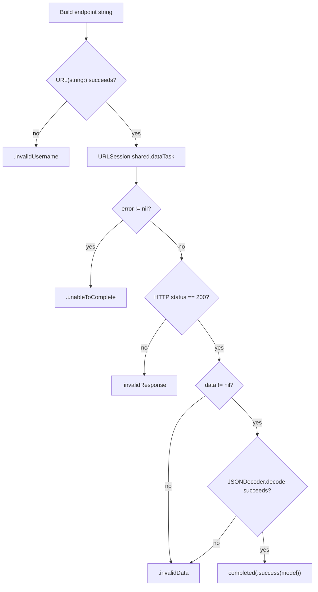
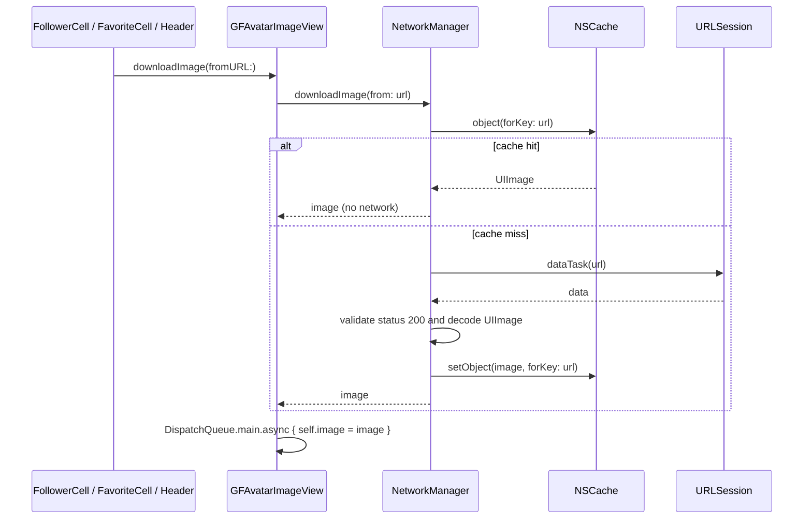
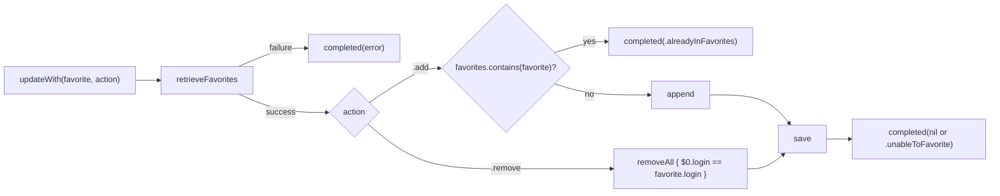

# Data Layer

> [← Back to README](../README.md) · [Architecture](ARCHITECTURE.md) · [UI Components](UI_COMPONENTS.md) · [Contributing](CONTRIBUTING.md)

This document covers everything below the UI: the models, how they're fetched from GitHub, how avatars are cached, how favorites are stored, and how errors are reported.

---

## Contents

1. [Models](#models)
2. [NetworkManager](#networkmanager)
3. [Request pipeline](#request-pipeline)
4. [Pagination](#pagination)
5. [Image downloading and caching](#image-downloading-and-caching)
6. [PersistenceManager](#persistencemanager)
7. [Error handling (`GFError`)](#error-handling-gferror)
8. [Date formatting](#date-formatting)
9. [GitHub API limits](#github-api-limits)

---

## Models

Both models are `Codable` structs marked `nonisolated`. Because the project's default actor isolation is `MainActor`, this opt-out is what lets them be decoded on `URLSession`'s background queue.

### `Follower`

`Model/Follower.swift`. Used for the followers grid **and** for saved favorites.

| Property | Type | JSON key | Notes |
|---|---|---|---|
| `login` | `String` | `login` | GitHub username. Uniquely identifies a user in this app. |
| `avatarUrl` | `String` | `avatar_url` | Mapped automatically by `.convertFromSnakeCase` |

Conforms to `Codable`, `Hashable`, and `Sendable`. `Hashable` is required by `UICollectionViewDiffableDataSource` and by the duplicate check in `PersistenceManager`.

### `User`

`Model/User.swift`. A full profile from `GET /users/{username}`.

| Property | Type | JSON key | Shown in |
|---|---|---|---|
| `login` | `String` | `login` | Header title |
| `avatarUrl` | `String` | `avatar_url` | Header avatar |
| `name` | `String?` | `name` | Header subtitle (blank if `nil`) |
| `location` | `String?` | `location` | Header, next to the pin icon (`"No Location"` if `nil`) |
| `bio` | `String?` | `bio` | Header body, up to 3 lines (`"No bio available"` if `nil`) |
| `publicRepos` | `Int` | `public_repos` | Repo card |
| `publicGists` | `Int` | `public_gists` | Repo card |
| `htmlUrl` | `String` | `html_url` | Opened by **GitHub Profile** |
| `following` | `Int` | `following` | Followers card |
| `followers` | `Int` | `followers` | Followers card. `0` blocks **Get Followers**. |
| `createdAt` | `String` | `created_at` | Footer: `"GitHub since Mar 2018"` |

> The GitHub response has many more fields (such as `email`, `blog`, `company`, and `twitter_username`). `JSONDecoder` ignores keys that aren't declared, so new fields can be added by adding an optional property here and a label in `GFUserInfoHeaderVC`.

---

## NetworkManager

`Managers/NetworkManager.swift`

```text
NetworkManager (singleton)
├── shared: NetworkManager
├── baseURL = "https://api.github.com/users/"
├── cache: NSCache<NSString, UIImage>
├── getFollowers(for:page:completed:)   → Result<[Follower], GFError>
├── getUserInfo(for:completed:)         → Result<User, GFError>
└── downloadImage(from:completed:)      → UIImage?
```

| Method | Endpoint | Decoder configuration | Called from |
|---|---|---|---|
| `getFollowers(for:page:completed:)` | `/users/{username}/followers?per_page=50&page={page}` | `.convertFromSnakeCase` | `FollowerListVC.getFollowers`, both on first load and when paging |
| `getUserInfo(for:completed:)` | `/users/{username}` | `.convertFromSnakeCase`, `.iso8601` dates | `UserInfoVC.getUserInfo` and `FollowerListVC.addButtonTapped` |
| `downloadImage(from:completed:)` | Any avatar URL | — | `GFAvatarImageView.downloadImage(fromURL:)` |

---

## Request pipeline

`getFollowers` and `getUserInfo` follow the same steps. Each step that fails maps to one specific `GFError`:



Some details:

- **Completion handlers run on a background queue.** Callers must switch to the main queue for UI work. The view controllers do this with `DispatchQueue.main.async` or `presentGFAlertOnMainThread`.
- **Only HTTP 200 counts as success.** A 404 (unknown user) and a 403 (rate-limited) both become `.invalidResponse`.
- **Usernames are inserted into the URL as typed.** Since iOS 17, `URL(string:)` percent-encodes invalid characters (such as spaces) instead of returning `nil`, so malformed input usually reaches GitHub and comes back as a 404 (`.invalidResponse`). `.invalidUsername` is effectively a safety net. GitHub usernames can only contain letters, numbers, and hyphens, so trimming whitespace before searching would be a cheap improvement.

---

## Pagination

GitHub returns at most `per_page` items per request. The app always asks for **50**.

```text
page 1 → followers 1–50
page 2 → followers 51–100
...
A page with fewer than 50 items is the last one → hasMoreFollowers = false
```

`FollowerListVC` asks for the next page from `scrollViewDidEndDragging(_:willDecelerate:)` when:

```text
contentOffset.y > contentSize.height − frame.height     // dragged past the bottom
&& hasMoreFollowers
&& !isLoadingMoreFollowers
```

> **Edge case:** A user with exactly 50 × *n* followers triggers one extra request that returns `[]`. The empty page is appended harmlessly and pagination stops.

---

## Image downloading and caching



- **Cache key:** the full avatar URL string (as an `NSString`).
- **Lifetime:** memory only. `NSCache` frees entries automatically when the system is low on memory, and the cache is cleared when the app quits.
- **Failures** return `nil` silently. Image errors are never shown to the user.
- **Placeholder:** `GFAvatarImageView` starts with `Images.placeholder` (`avatar-placeholder`, with a dark-mode variant).

---

## PersistenceManager

`Managers/PersistenceManager.swift`. A case-less `enum` with only static methods, so it can't be instantiated.

### Storage format

| Item | Value |
|---|---|
| Store | `UserDefaults.standard` |
| Key | `"favorites"` (`PersistenceManager.Keys.favorites`) |
| Value | `Data`: a JSON array of `Follower` made with `JSONEncoder` |
| Example | `[{"login":"dhh","avatarUrl":"https://avatars.githubusercontent.com/u/2741?v=4"}]` |

> `JSONEncoder` uses the default key strategy, so stored keys are camelCase (`avatarUrl`), not GitHub's snake_case. Saving and loading are symmetric, so this works. Keep it in mind if you ever change the key strategy.

### API

| Method | Behavior |
|---|---|
| `retrieveFavorites(completed:)` | Returns `.success([])` if nothing has been saved yet. Returns `.failure(.unableToFavorite)` if the stored data can't be decoded. |
| `updateWith(favorite:actionType:completed:)` | Reads the current list, applies `.add` or `.remove`, saves, and calls `completed(nil)` on success or `completed(GFError)` on failure. |
| `save(favorites:) -> GFError?` | Encodes and writes the whole array. Returns `.unableToFavorite` if encoding fails. |

### Add / remove rules



- **Duplicates** are detected with `Hashable` equality, which compares **both** `login` and `avatarUrl`.
- **Removal** matches on `login` only.
- **Where favorites are created:** the **+** button in `FollowerListVC` favorites the user *whose followers are on screen*. It fetches that user's `User` record and saves `Follower(login:avatarUrl:)`. To favorite one of the followers, open their details sheet, tap **Get Followers**, and then tap **+**.

> **Why `UserDefaults`?** A favorites list is small, flat, and has no relationships, so Core Data or SwiftData would be overkill. `UserDefaults` needs no setup and survives app restarts. If favorites ever store richer data or grow to thousands of entries, a file in Application Support or SwiftData would be a better fit.

---

## Error handling (`GFError`)

`Utilities/GFError.swift`. A `String`-backed `enum` that conforms to `Error`. Its **raw value is the message shown to the user**, so a view controller can show any failure with `error.rawValue`.

| Case | Message | Raised when |
|---|---|---|
| `.invalidUsername` | This username created an invalid request. Please try again. | The endpoint string can't be turned into a `URL` |
| `.unableToComplete` | Unable to complete your request. Please check your internet connection. | `URLSession` returned a transport error (offline, timeout, DNS, …) |
| `.invalidResponse` | Invalid response from the server. Please try again. | HTTP status isn't 200 (404 unknown user, 403 rate limit, 5xx, …) |
| `.invalidData` | The data received from the server was invalid. Please try again. | No body, or JSON decoding failed |
| `.unableToFavorite` | There was an error favoriting this user. Please try again. | Encoding or decoding favorites in `UserDefaults` failed |
| `.alreadyInFavorites` | You've already favorited this user, you must really like them. | Adding a user who is already saved |

Each error is shown through `presentGFAlertOnMainThread(title:message:buttonTitle:)`:

| Screen | Alert title |
|---|---|
| `FollowerListVC` (loading followers) | "Bad stuff happened" |
| `FollowerListVC` (adding favorite), `UserInfoVC`, `FavoritesListVC` | "Something went wrong" |
| `FavoritesListVC` (removing favorite) | "Unable to remove" |

---

## Date formatting

GitHub sends `created_at` as an ISO-8601 string, for example `"2018-03-14T09:21:45Z"`. `User.createdAt` is stored as a `String` and formatted for display in two steps:

```text
"2018-03-14T09:21:45Z"
   │  String.convertToDate()            DateFormatter "yyyy-MM-dd'T'HH:mm:ssZ", en_US_POSIX
   ▼
Date
   │  Date.convertToMonthYearFormat()   DateFormatter "MMM yyyy"
   ▼
"Mar 2018"   → "GitHub since Mar 2018"
```

If parsing fails, `convertToDisplayFormat()` returns `"N/A"`.

> `getUserInfo` sets `decoder.dateDecodingStrategy = .iso8601`, but it has no effect today because `createdAt` is a `String`, not a `Date`. Changing the property to `Date` would let the decoder handle parsing, and `String+Ext.convertToDate()` could then be removed.

---

## GitHub API limits

| Item | Value |
|---|---|
| Authentication | None (anonymous requests) |
| Rate limit | **60 requests per hour per IP address** ([GitHub docs](https://docs.github.com/en/rest/using-the-rest-api/rate-limits-for-the-rest-api)) |
| What uses up the limit | Each followers page, each details sheet, and each **+** tap is one request. Avatar downloads come from `avatars.githubusercontent.com` and don't count toward the limit. |
| Symptom when exceeded | HTTP 403, shown as `.invalidResponse` |

For heavy use, an authenticated request (`Authorization: Bearer <token>`) raises the limit to 5,000 requests per hour. See the roadmap in [CONTRIBUTING.md](CONTRIBUTING.md#roadmap).
